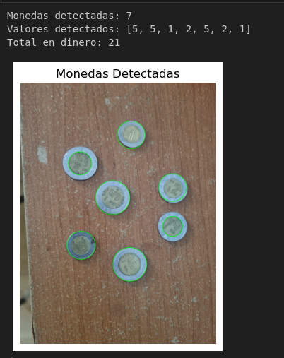

# Project Title: Detección y Clasificación de Monedas con OpenCV

## 🧾 Overview

Este proyecto implementa detección y clasificación de monedas en imágenes mediante Python. Utiliza OpenCV para el procesamiento de imagen y Matplotlib para visualización. El objetivo es identificar monedas (1, 2 o 5 pesos) en una imagen, basándose en el tamaño (radio) de los círculos detectados.

Se realiza lo siguiente:
- Conversión de la imagen a escala de grises.
- Aplicación de desenfoque gaussiano para reducir ruido.
- Detección de círculos (monedas) usando la Transformada de Hough.
- Clasificación de cada moneda según su radio.
- Dibujo de los círculos detectados en la imagen.
- Cálculo del valor total detectado.
- Visualización de cada moneda individual.

---

## 📁 Files

- **Coin Counter.ipynb**: Archivo Python que contiene el código para procesar imágenes y detectar monedas.
- **requirements.txt**: Lista de las dependencias necesarias.
- **README.md**: Este documento con toda la explicación del proyecto.

---

## 🔧 Installation

1. Clona el repositorio:
   ```bash
   git clone <repository-url>
   cd <project-folder>

2. Instala las dependencias necesarias:

    pip install -r requirements.txt

## ▶️ Usage

    1. Correr cada bloque de codigo en orden.
    2. Subir imagen en el segundo bloque de monedas.
    3. Correr el tercer bloque y ver la informacion de las monedas contadas.





💡 Notas adicionales
Los umbrales entre tipos de moneda se calculan automáticamente usando percentiles (33% y 66%) del tamaño de los radios detectados.

El código es fácilmente adaptable a monedas de otros valores o tamaños.

Actualmente solo detecta monedas de 1,2 y 5 pesos, además que tiene que haber una de cada valor para que funcione.

